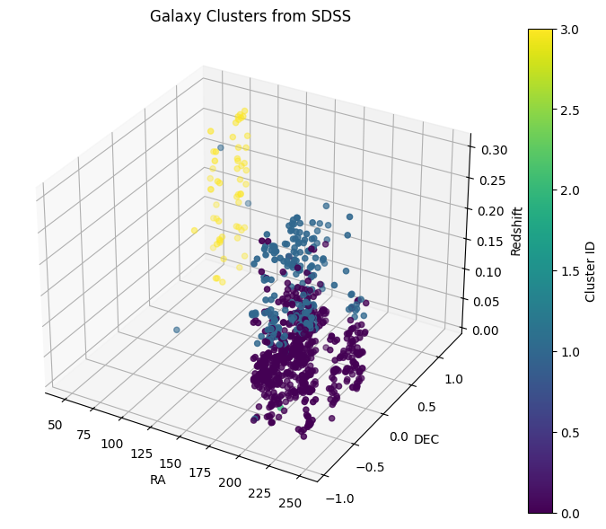

# 🌌 CosmoLink

> **Hierarchical Grouping of Galaxies Based on Spatial Coordinates and Properties**

---

## 🚀 Project Overview
**CosmoLink** is a machine learning project focused on clustering galaxies based on their spatial coordinates and astrophysical properties.  
Using **Agglomerative Hierarchical Clustering**, CosmoLink uncovers natural groupings and structural patterns in galactic data obtained from the **Sloan Digital Sky Survey (SDSS)**.

The project aims to reveal hidden cosmic structures by analyzing:
- **Right Ascension (RA)** and **Declination (Dec)** (spatial positions)
- **Astrophysical properties** (like redshift, magnitudes)

## 🛰️ Dataset

- **Source:** Sloan Digital Sky Survey (SDSS)  
- **Contents:** Spatial coordinates, redshift values, photometric properties of galaxies.

## 🧠 Methodology

1. **Data Loading:**  
   Load galaxy data from SDSS.

2. **Preprocessing:**  
   - Handle missing values
   - Normalize spatial coordinates and features

3. **Feature Selection:**  
   - Spatial coordinates (RA, Dec)
   - Redshift and other astrophysical properties

4. **Clustering:**  
   - Apply **Agglomerative Hierarchical Clustering**  
   - Choose optimal linkage method (ward/complete/average)

5. **Visualization:**  
   - Scatter plots colored by cluster labels
   - Dendrogram analysis

6. **Evaluation:**  
   - Analyze clustering performance
   - Explore physical significance of identified groups

## 📊 Results

- Identified meaningful galactic clusters based on spatial distribution.
- Visualized cosmic structures and potential galaxy groupings.
- Explored hierarchical relationships between galaxy clusters.

Here's a 3D visualization of Galaxy Clusters:

## ✨ Future Work

- Incorporate more astrophysical features (spectral lines, mass estimates).
- Compare with other clustering techniques (e.g., DBSCAN, KMeans).
- 3D clustering using RA, Dec, and redshift as distance proxy.